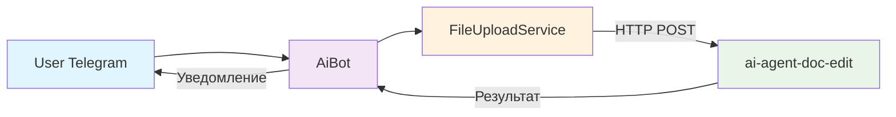
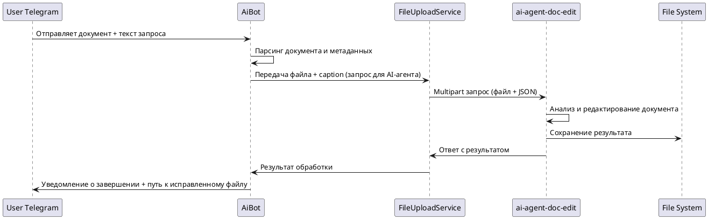

# ai-chatbot
Telegram бот для взаимодействия с AI-агентом для обработки документов. Бот принимает документы Word и текстовые инструкции от пользователей,
передаёт их AI-агенту для анализа и редактирования, возвращает результаты.

## 1. Назначение
- 📱 Удобный Telegram-интерфейс для работы с AI-агентом
- 📄 Поддержка загрузки документов
- 💬 Кнопки для навигации

## 2. Функционал

### 2.1. Основные возможности:
- Загрузка файлов — поддержка документов Word
- Интеграция с AI-агентом — автоматическая передача файлов в `ai-agent-doc-edit`, возврат результатов работы агента
- Уведомления — о статусе обработки, результатах работы агента
- Callback-обработка — обработка нажатий на инлайн-кнопки
- Интерактивные элементы — кнопки Help и About для навигации и в ответе о результатах работы AI-агента

### 2.2. Поддерживаемые команды:
```
/start - Начало работы с ботом
/help  - Получить инструкцию по использованию
/about - Информация о боте и технологиях
```
## 3. Решение (Architecture & Solution)
Система построена по принципу клиент-серверной архитектуры, где Telegram бот выступает в роли клиентского интерфейса. AI-агент `ai-agent-doc-edit` выполняет основную обработку документов.

Ключевые компоненты:
- Конфигурация: `TelegramBotConfig` - содержит бины для работы с Telegram API.
- Бот: `AiBot` - основной экземпляр бота, обрабатывает все входящие сообщения.
- Взаимодействие с AI-агентом: `FileUploadService` - формирование и передача multipart запроса (запрос+файл) AI-агенту+получение ответа.
- Команды: `BotCommand` - интерфейс для имплементации команд бота.

Диаграмма вызовов и взаимодействия компонентов:



## 4. Техническая реализация (коротко)
- Формат входа: Telegram сообщение с документом и текстовой инструкцией пользователя.  
- Обработка: Документ скачивается через Telegram API и передаётся вместе с UserRq JSON в multipart/form-data запросе к `ai-agent-doc-edit`.  
- Интеграция: FileUploadService формирует HTTP POST-запрос, содержащий бинарные данные файла и метаданные пользователя (chatId, username, текстовый запрос).  
- Результат: Ответ от `ai-agent-doc-edit` преобразуется в читаемое уведомление и отправляется пользователю в Telegram с инлайн-кнопками для навигации.

## 5. Стек технологий:
- Язык Java 17
- Фреймворк Spring Boot 3.4.3
- Интеграция с Telegram Telegram Bot API 6.9.7.1
- Lombok для логов/снижения шаблонного кода
- Сборка: Maven

## 6. Ссылки:
- Демо-видео работы с AI-агентом через бота: https://t.me/ai_alchemy2025/10
